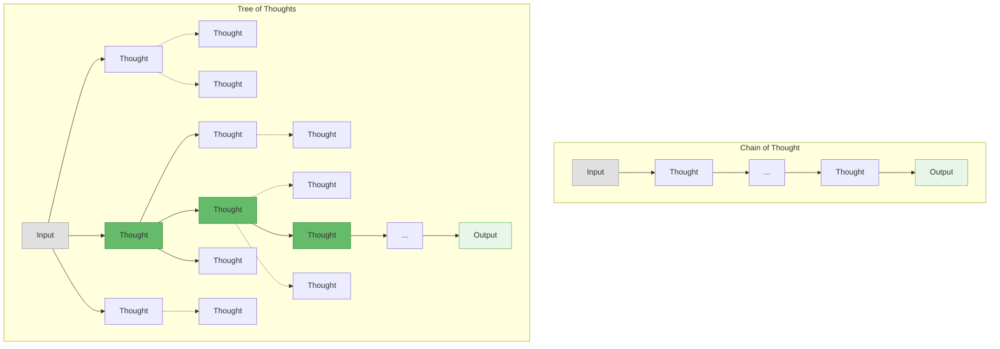

# Prompt Engineering

Author: Lee Boonstra

A large, multi-faceted geometric shape, similar to a crystal, with various planes reflecting gradients of deep purple and bright blue.

# Acknowledgements

## Content contributors

Michael Sherman
Yuan Cao
Erick Armbrust
Anant Nawalgaria
Antonio Gulli
Simone Cammel

## Curators and Editors

Antonio Gulli
Anant Nawalgaria
Grace Mollison

## Technical Writer

Joey Haymaker

## Designer

Michael Lanning

The right side of the page features a large, abstract, three-dimensional geometric shape. It is composed of numerous sharp, angular facets in shades of metallic silver and deep, reflective blue, giving it the appearance of a large, polished gemstone or a complex crystalline structure.

# Table of contents

Introduction 6
Prompt engineering 7
LLM output configuration 8
* Output length 8
* Sampling controls 9
    - Temperature 9
    - Top-K and top-P 10
    - Putting it all together 11
Prompting techniques 13
* General prompting / zero shot 13
* One-shot & few-shot 15
* System, contextual and role prompting 18
    - System prompting 19
    - Role prompting 21
    - Contextual prompting 23

Step-back prompting 25

Chain of Thought (CoT) 29

Self-consistency 32

Tree of Thoughts (ToT) 36

ReAct (reason & act) 37

Automatic Prompt Engineering 40

Code prompting 42

* Prompts for writing code 42
* Prompts for explaining code 44
* Prompts for translating code 46
* Prompts for debugging and reviewing code 48
* What about multimodal prompting? 54

**Best Practices** 54

* Provide examples 54
* Design with simplicity 55
* Be specific about the output 56
* Use Instructions over Constraints 56
* Control the max token length 58
* Use variables in prompts 58
* Experiment with input formats and writing styles 59
* For few-shot prompting with classification tasks, mix up the classes 59
* Adapt to model updates 60
* Experiment with output formats 60

JSON Repair 61

Working with Schemas 62

Experiment together with other prompt engineers 63

CoT Best practices 64

Document the various prompt attempts 64

**Summary** 66

**Endnotes** 68

> You don't need to be a data scientist or a machine learning engineer – everyone can write a prompt.

# Introduction

When thinking about a large language model input and output, a text prompt (sometimes accompanied by other modalities such as image prompts) is the input the model uses to predict a specific output. You don't need to be a data scientist or a machine learning engineer – everyone can write a prompt. However, crafting the most effective prompt can be complicated. Many aspects of your prompt affect its efficacy: the model you use, the model's training data, the model configurations, your word-choice, style and tone, structure, and context all matter. Therefore, prompt engineering is an iterative process. Inadequate prompts can lead to ambiguous, inaccurate responses, and can hinder the model's ability to provide meaningful output.

When you chat with the Gemini chatbot,<sup>1</sup> you basically write prompts, however this whitepaper focuses on writing prompts for the Gemini model within Vertex AI or by using the API, because by prompting the model directly you will have access to the configuration such as temperature etc.

This whitepaper discusses prompt engineering in detail. We will look into the various prompting techniques to help you getting started and share tips and best practices to become a prompting expert. We will also discuss some of the challenges you can face while crafting prompts.

# Prompt engineering

Remember how an LLM works; it’s a prediction engine. The model takes sequential text as an input and then predicts what the following token should be, based on the data it was trained on. The LLM is operationalized to do this over and over again, adding the previously predicted token to the end of the sequential text for predicting the following token. The next token prediction is based on the relationship between what’s in the previous tokens and what the LLM has seen during its training.

When you write a prompt, you are attempting to set up the LLM to predict the right sequence of tokens. Prompt engineering is the process of designing high-quality prompts that guide LLMs to produce accurate outputs. This process involves tinkering to find the best prompt, optimizing prompt length, and evaluating a prompt’s writing style and structure in relation to the task. In the context of natural language processing and LLMs, a prompt is an input provided to the model to generate a response or prediction.

These prompts can be used to achieve various kinds of understanding and generation tasks such as text summarization, information extraction, question and answering, text classification, language or code translation, code generation, and code documentation or reasoning.

Please feel free to refer to Google’s prompting guides<sup>2,3</sup> with simple and effective prompting examples.

When prompt engineering, you will start by choosing a model. Prompts might need to be optimized for your specific model, regardless of whether you use Gemini language models in Vertex AI, GPT, Claude, or an open source model like Gemma or LLaMA.

Besides the prompt, you will also need to tinker with the various configurations of a LLM.

# LLM output configuration

Once you choose your model you will need to figure out the model configuration. Most LLMs come with various configuration options that control the LLM’s output. Effective prompt engineering requires setting these configurations optimally for your task.

## Output length

An important configuration setting is the number of tokens to generate in a response. Generating more tokens requires more computation from the LLM, leading to higher energy consumption, potentially slower response times, and higher costs.

Reducing the output length of the LLM doesn’t cause the LLM to become more stylistically or textually succinct in the output it creates, it just causes the LLM to stop predicting more tokens once the limit is reached. If your needs require a short output length, you’ll also possibly need to engineer your prompt to accommodate.

Output length restriction is especially important for some LLM prompting techniques, like ReAct, where the LLM will keep emitting useless tokens after the response you want.

Be aware, generating more tokens requires more computation from the LLM, leading to higher energy consumption and potentially slower response times, which leads to higher costs.

## Sampling controls

LLMs do not formally predict a single token. Rather, LLMs predict probabilities for what the next token could be, with each token in the LLM’s vocabulary getting a probability. Those token probabilities are then sampled to determine what the next produced token will be. Temperature, top-K, and top-P are the most common configuration settings that determine how predicted token probabilities are processed to choose a single output token.

### Temperature

Temperature controls the degree of randomness in token selection. Lower temperatures are good for prompts that expect a more deterministic response, while higher temperatures can lead to more diverse or unexpected results. A temperature of 0 (greedy decoding) is

deterministic: the highest probability token is always selected (though note that if two tokens have the same highest predicted probability, depending on how tiebreaking is implemented you may not always get the same output with temperature 0).

Temperatures close to the max tend to create more random output. And as temperature gets higher and higher, all tokens become equally likely to be the next predicted token.

The Gemini temperature control can be understood in a similar way to the softmax function used in machine learning. A low temperature setting mirrors a low softmax temperature (T), emphasizing a single, preferred temperature with high certainty. A higher Gemini temperature setting is like a high softmax temperature, making a wider range of temperatures around the selected setting more acceptable. This increased uncertainty accommodates scenarios where a rigid, precise temperature may not be essential like for example when experimenting with creative outputs.

## Top-K and top-P

Top-K and top-P (also known as nucleus sampling)<sup>4</sup> are two sampling settings used in LLMs to restrict the predicted next token to come from tokens with the top predicted probabilities. Like temperature, these sampling settings control the randomness and diversity of generated text.

*   **Top-K** sampling selects the top K most likely tokens from the model’s predicted distribution. The higher top-K, the more creative and varied the model’s output; the lower top-K, the more restive and factual the model’s output. A top-K of 1 is equivalent to greedy decoding.

*   **Top-P** sampling selects the top tokens whose cumulative probability does not exceed a certain value (P). Values for P range from 0 (greedy decoding) to 1 (all tokens in the LLM’s vocabulary).

The best way to choose between top-K and top-P is to experiment with both methods (or both together) and see which one produces the results you are looking for.

## Putting it all together

Choosing between top-K, top-P, temperature, and the number of tokens to generate, depends on the specific application and desired outcome, and the settings all impact one another. It’s also important to make sure you understand how your chosen model combines the different sampling settings together.

If temperature, top-K, and top-P are all available (as in Vertex Studio), tokens that meet both the top-K and top-P criteria are candidates for the next predicted token, and then temperature is applied to sample from the tokens that passed the top-K and top-P criteria. If only top-K or top-P is available, the behavior is the same but only the one top-K or P setting is used.

If temperature is not available, whatever tokens meet the top-K and/or top-P criteria are then randomly selected from to produce a single next predicted token.

At extreme settings of one sampling configuration value, that one sampling setting either cancels out other configuration settings or becomes irrelevant.

* If you set temperature to 0, top-K and top-P become irrelevant—the most probable token becomes the next token predicted. If you set temperature extremely high (above 1—generally into the 10s), temperature becomes irrelevant and whatever tokens make it through the top-K and/or top-P criteria are then randomly sampled to choose a next predicted token.
* If you set top-K to 1, temperature and top-P become irrelevant. Only one token passes the top-K criteria, and that token is the next predicted token. If you set top-K extremely high, like to the size of the LLM’s vocabulary, any token with a nonzero probability of being the next token will meet the top-K criteria and none are selected out.
* If you set top-P to 0 (or a very small value), most LLM sampling implementations will then only consider the most probable token to meet the top-P criteria, making temperature and top-K irrelevant. If you set top-P to 1, any token with a nonzero probability of being the next token will meet the top-P criteria, and none are selected out.

As a general starting point, a temperature of .2, top-P of .95, and top-K of 30 will give you relatively coherent results that can be creative but not excessively so. If you want especially creative results, try starting with a temperature of .9, top-P of .99, and top-K of 40. And if you want less creative results, try starting with a temperature of .1, top-P of .9, and top-K of 20. Finally, if your task always has a single correct answer (e.g., answering a math problem), start with a temperature of 0.

**NOTE:** With more freedom (higher temperature, top-K, top-P, and output tokens), the LLM might generate text that is less relevant.

**WARNING:** Have you ever seen a response ending with a large amount of filler words? This is also known as the "repetition loop bug", which is a common issue in Large Language Models where the model gets stuck in a cycle, repeatedly generating the same (filler) word, phrase, or sentence structure, often exacerbated by inappropriate temperature and top-k/

top-p settings. This can occur at both low and high temperature settings, though for different reasons. At low temperatures, the model becomes overly deterministic, sticking rigidly to the highest probability path, which can lead to a loop if that path revisits previously generated text. Conversely, at high temperatures, the model's output becomes excessively random, increasing the probability that a randomly chosen word or phrase will, by chance, lead back to a prior state, creating a loop due to the vast number of available options. In both cases, the model's sampling process gets "stuck," resulting in monotonous and unhelpful output until the output window is filled. Solving this often requires careful tinkering with temperature and top-k/top-p values to find the optimal balance between determinism and randomness.

# Prompting techniques

LLMs are tuned to follow instructions and are trained on large amounts of data so they can understand a prompt and generate an answer. But LLMs aren’t perfect; the clearer your prompt text, the better it is for the LLM to predict the next likely text. Additionally, specific techniques that take advantage of how LLMs are trained and how LLMs work will help you get the relevant results from LLMs

Now that we understand what prompt engineering is and what it takes, let’s dive into some examples of the most important prompting techniques.

## General prompting / zero shot

A *zero-shot*<sup>5</sup> prompt is the simplest type of prompt. It only provides a description of a task and some text for the LLM to get started with. This input could be anything: a question, a start of a story, or instructions. The name zero-shot stands for ’no examples’.

Let's use Vertex AI Studio (for Language) in Vertex AI,<sup>6</sup> which provides a playground to test prompts. In Table 1, you will see an example zero-shot prompt to classify movie reviews.

The table format as used below is a great way of documenting prompts. Your prompts will likely go through many iterations before they end up in a codebase, so it's important to keep track of your prompt engineering work in a disciplined, structured way. More on this table format, the importance of tracking prompt engineering work, and the prompt development process is in the Best Practices section later in this chapter ("Document the various prompt attempts").

The model temperature should be set to a low number, since no creativity is needed, and we use the gemini-pro default top-K and top-P values, which effectively disable both settings (see 'LLM Output Configuration' above). Pay attention to the generated output. The words *disturbing* and *masterpiece* should make the prediction a little more complicated, as both words are used in the same sentence.

<table>
  <tbody>
    <tr>
        <td>Name</td>
        <td colspan="3">1_1_movie_classification</td>
    </tr>
    <tr>
        <td>Goal</td>
        <td colspan="3">Classify movie reviews as positive, neutral or negative.</td>
    </tr>
    <tr>
        <td>Model</td>
        <td colspan="3">gemini-pro</td>
    </tr>
    <tr>
        <td>Temperature</td>
        <td>0.1</td>
        <td>Token Limit</td>
        <td>5</td>
    </tr>
    <tr>
        <td>Top-K</td>
        <td>N/A</td>
        <td>Top-P</td>
        <td>1</td>
    </tr>
    <tr>
        <td>Prompt</td>
        <td colspan="3">Classify movie reviews as POSITIVE, NEUTRAL or NEGATIVE.<br/>Review: Her is a disturbing study revealing the direction<br/>humanity is headed if AI is allowed to keep evolving,<br/>unchecked. I wish there were more movies like this masterpiece.<br/>Sentiment:</td>
    </tr>
    <tr>
        <td>Output</td>
        <td colspan="3">POSITIVE</td>
    </tr>
  </tbody>
</table>

Table 1. An example of zero-shot prompting

When zero-shot doesn’t work, you can provide demonstrations or examples in the prompt, which leads to “one-shot” and “few-shot” prompting. General prompting / zero shot

## One-shot & few-shot

When creating prompts for AI models, it is helpful to provide examples. These examples can help the model understand what you are asking for. Examples are especially useful when you want to steer the model to a certain output structure or pattern.

A **one-shot prompt**, provides a *single* example, hence the name one-shot. The idea is the model has an example it can imitate to best complete the task.

A **few-shot prompt**<sup>7</sup> provides *multiple* examples to the model. This approach shows the model a pattern that it needs to follow. The idea is similar to one-shot, but multiple examples of the desired pattern increases the chance the model follows the pattern.

The number of examples you need for few-shot prompting depends on a few factors, including the complexity of the task, the quality of the examples, and the capabilities of the generative AI (gen AI) model you are using. As a general rule of thumb, you should use at least three to five examples for few-shot prompting. However, you may need to use more examples for more complex tasks, or you may need to use fewer due to the input length limitation of your model.

Table 2 shows a few-shot prompt example, let’s use the same gemini-pro model configuration settings as before, other than increasing the token limit to accommodate the need for a longer response.

<table>
  <tbody>
    <tr>
        <td>Goal</td>
        <td colspan="3">Parse pizza orders to JSON</td>
    </tr>
    <tr>
        <td>Model</td>
        <td colspan="3">gemini-pro</td>
    </tr>
    <tr>
        <td>Temperature</td>
        <td>0.1</td>
        <td>Token Limit</td>
        <td>250</td>
    </tr>
    <tr>
        <td>Top-K</td>
        <td>N/A</td>
        <td>Top-P</td>
        <td>1</td>
    </tr>
    <tr>
        <td>Prompt</td>
        <td colspan="3">Parse a customer's pizza order into valid JSON:<br/><br/>EXAMPLE:<br/>I want a small pizza with cheese, tomato sauce, and pepperoni.<br/>JSON Response:<br/></td>
    </tr>
  </tbody>
</table><br/>{<br/>"size": "small",<br/>"type": "normal",<br/>"ingredients": [["cheese", "tomato sauce", "peperoni"]]<br/>}<br/>```<br/><br/>**Continues next page...**
```

<table>
  <tbody>
    <tr>
        <td>Prompt</td>
        <td>EXAMPLE:<br/>Can I get a large pizza with tomato sauce, basil and mozzarella<br/><br/>{<br/>size: large,<br/>type: normal,<br/>ingredients: [[tomato sauce, bazel, mozzarella]]<br/>}<br/><br/>Now, I would like a large pizza, with the first half cheese and mozzarella. And the other tomato sauce, ham and pineapple.<br/><br/>JSON Response:</td>
    </tr>
    <tr>
        <td>Output</td>
        <td></td>
    </tr>
  </tbody>
</table><br/>{<br/>"size": "large",<br/>"type": "half-half",<br/>"ingredients": [["cheese", "mozzarella"], ["tomato sauce", "ham", "pineapple"]]<br/>}<br/>```
```

Table 2. An example of few-shot prompting

When you choose examples for your prompt, use examples that are relevant to the task you want to perform. The examples should be diverse, of high quality, and well written. One small mistake can confuse the model and will result in undesired output.

If you are trying to generate output that is robust to a variety of inputs, then it is important to include edge cases in your examples. Edge cases are inputs that are unusual or unexpected, but that the model should still be able to handle.

# System, contextual and role prompting

System, contextual and role prompting are all techniques used to guide how LLMs generate text, but they focus on different aspects:

* **System prompting** sets the overall context and purpose for the language model. It defines the ‘big picture’ of what the model should be doing, like translating a language, classifying a review etc.
* **Contextual prompting** provides specific details or background information relevant to the current conversation or task. It helps the model to understand the nuances of what’s being asked and tailor the response accordingly.
* **Role prompting** assigns a specific character or identity for the language model to adopt. This helps the model generate responses that are consistent with the assigned role and its associated knowledge and behavior.

There can be considerable overlap between system, contextual, and role prompting. E.g. a prompt that assigns a role to the system, can also have a context.

However, each type of prompt serves a slightly different primary purpose:

* System prompt: Defines the model’s fundamental capabilities and overarching purpose.
* Contextual prompt: Provides immediate, task-specific information to guide the response. It’s highly specific to the current task or input, which is dynamic.
* Role prompt: Frames the model’s output style and voice. It adds a layer of specificity and personality.

Distinguishing between system, contextual, and role prompts provides a framework for designing prompts with clear intent, allowing for flexible combinations and making it easier to analyze how each prompt type influences the language model’s output.

Let’s dive into these three different kinds of prompts.

## System prompting

Table 3 contains a system prompt, where I specify additional information on how to return the output. I increased the temperature to get a higher creativity level, and I specified a higher token limit. However, because of my clear instruction on how to return the output the model didn’t return extra text.

<table>
  <tbody>
    <tr>
        <td>Goal</td>
        <td colspan="3">Classify movie reviews as positive, neutral or negative.</td>
    </tr>
    <tr>
        <td>Model</td>
        <td colspan="3">gemini-pro</td>
    </tr>
    <tr>
        <td>Temperature</td>
        <td>1</td>
        <td>Token Limit</td>
        <td>5</td>
    </tr>
    <tr>
        <td>Top-K</td>
        <td>40</td>
        <td>Top-P</td>
        <td>0.8</td>
    </tr>
    <tr>
        <td>Prompt</td>
        <td colspan="3">Classify movie reviews as positive, neutral or negative. Only return the label in uppercase.<br/>Review: Her is a disturbing study revealing the direction humanity is headed if AI is allowed to keep evolving, unchecked. It's so disturbing I couldn't watch it.<br/>Sentiment:</td>
    </tr>
    <tr>
        <td>Output</td>
        <td colspan="3">NEGATIVE</td>
    </tr>
  </tbody>
</table>
Table 3. An example of system prompting

System prompts can be useful for generating output that meets specific requirements. The name ‘system prompt’ actually stands for ‘providing an additional task to the system’. For example, you could use a system prompt to generate a code snippet that is compatible with a specific programming language, or you could use a system prompt to return a certain structure. Have a look into Table 4, where I return the output in JSON format.

<table>
  <tbody>
    <tr>
        <td>Goal</td>
        <td colspan="3">Classify movie reviews as positive, neutral or negative, return JSON.</td>
    </tr>
    <tr>
        <td>Model</td>
        <td colspan="3">gemini-pro</td>
    </tr>
    <tr>
        <td>Temperature</td>
        <td>1</td>
        <td>Token Limit</td>
        <td>1024</td>
    </tr>
    <tr>
        <td>Top-K</td>
        <td>40</td>
        <td>Top-P</td>
        <td>0.8</td>
    </tr>
    <tr>
        <td>Prompt</td>
        <td colspan="3">Classify movie reviews as positive, neutral or negative. Return valid JSON:<br/><br/>Review: Her is a disturbing study revealing the direction humanity is headed if AI is allowed to keep evolving, unchecked. It's so disturbing I couldn't watch it.<br/><br/>Schema:<br/></td>
    </tr>
  </tbody>
</table><br/>MOVIE:<br/>{<br/>"sentiment": String "POSITIVE" | "NEGATIVE" | "NEUTRAL",<br/>"name": String<br/>}<br/>MOVIE REVIEWS:<br/>{<br/>"movie_reviews": [MOVIE]<br/>}<br/><table>
  <tbody>
    <tr>
        <td>Output</td>
        <td colspan="3"></td>
    </tr>
  </tbody>
</table><br/>{<br/>  "movie_reviews": [<br/>    {<br/>      "sentiment": "NEGATIVE",<br/>      "name": "Her"<br/>    }<br/>  ]<br/>}<br/>```
```

Table 4. An example of system prompting with JSON format

There are some benefits in returning JSON objects from a prompt that extracts data. In a real-world application I don’t need to manually create this JSON format, I can already return the data in a sorted order (very handy when working with datetime objects), but most importantly, by prompting for a JSON format it forces the model to create a structure and limit hallucinations.

System prompts can also be really useful for safety and toxicity. To control the output, simply add an additional line to your prompt like: ‘You should be respectful in your answer.’.

## Role prompting

Role prompting is a technique in prompt engineering that involves assigning a specific role to the gen AI model. This can help the model to generate more relevant and informative output, as the model can craft its responses to the specific role that it has been assigned.

For example, you could role prompt a gen AI model to be a book editor, a kindergarten teacher, or a motivational speaker. Once the model has been assigned a role, you can then give it prompts that are specific to that role. For example, you could prompt a teacher to create a lesson plan that they can then review. Have a look into Table 5, where the model takes the role of a travel guide.

<table>
  <tbody>
    <tr>
        <td>Goal</td>
        <td colspan="3">Act as travel guide and provide 3 travel suggestions</td>
    </tr>
    <tr>
        <td>Model</td>
        <td colspan="3">gemini-pro</td>
    </tr>
    <tr>
        <td>Temperature</td>
        <td>1</td>
        <td>Token Limit</td>
        <td>1024</td>
    </tr>
    <tr>
        <td>Top-K</td>
        <td>40</td>
        <td>Top-P</td>
        <td>0.8</td>
    </tr>
    <tr>
        <td>Prompt</td>
        <td colspan="3">I want you to act as a travel guide. I will write to you<br/>about my location and you will suggest 3 places to visit near<br/>me. In some cases, I will also give you the type of places I<br/>will visit.<br/>My suggestion: I am in Amsterdam and I want to visit<br/>only museums.<br/>Travel Suggestions:</td>
    </tr>
    <tr>
        <td>Output</td>
        <td colspan="3">1. Rijksmuseum: World-renowned museum, known for Dutch masterpieces<br/>like Rembrandt’s “The Night Watch.” Don’t miss the incredible collection of<br/>paintings and artifacts showcasing Dutch art and history.<br/><br/>2. Van Gogh Museum: Immerse yourself in the captivating works of Vincent<br/>van Gogh. The museum houses the largest collection of his paintings and<br/>drawings, including “The Starry Night” and “Sunflowers.”<br/><br/>3. Stedelijk Museum Amsterdam: Discover modern and contemporary art<br/>from around the world. The museum’s collection includes works by Picasso,<br/>Kandinsky, and Rietveld, housed in a striking modern building.</td>
    </tr>
  </tbody>
</table>

Table 5. An example of role prompting

The above example shows an example of taking the role of a travel agent. When you would change the role to a teacher of geography, you would notice that you will receive a different response.

Defining a role perspective for an AI model gives it a blueprint of the tone, style, and focused expertise you’re looking for to improve the quality, relevance, and effectiveness of your output.

Here are some styles you can choose from which I find effective:

Confrontational, Descriptive, Direct, Formal, Humorous, Influential, Informal, Inspirational, Persuasive

Let’s change our prompt in Table 6 to include a humorous and inspirational style.

<table>
  <tbody>
    <tr>
        <td>Prompt</td>
        <td>I want you to act as a travel guide. I will write to you about<br/>my location and you will suggest 3 places to visit near me in<br/>a humorous style.<br/>My suggestion: I am in Manhattan.<br/>Travel Suggestions:</td>
    </tr>
    <tr>
        <td>Output</td>
        <td>1. Behold the Empire State of Mind: Ascend to the dizzying heights of the Empire State Building and bask in the glory of Manhattan's skyline. Prepare to feel like King Kong atop the Big Apple, minus the giant ape-sized banana.<br/>2. Get Artsy-Fartsy at MoMA: Unleash your inner art aficionado at the Museum of Modern Art (MoMA). Gaze upon masterpieces that will boggle your mind and make you question whether your stick-figure drawings have any artistic merit.<br/>3. Shop ‘Til You Drop on Fifth Avenue: Indulge in some retail therapy on the iconic Fifth Avenue. Brace yourself for sticker shock as you window-shop (or actually shop) at designer boutiques that will make your wallet cry. But hey, you’re in Manhattan, so you might as well embrace the fabulousness!</td>
    </tr>
  </tbody>
</table>

Table 6. An example of role prompting with a humorous tone and style

## Contextual prompting

By providing contextual prompts, you can help ensure that your AI interactions are as seamless and efficient as possible. The model will be able to more quickly understand your request and be able to generate more accurate and relevant responses, as you can see in the example of Table 7.

<table>
  <tbody>
    <tr>
        <td>Goal</td>
        <td colspan="3">Suggest articles for a blog about retro games</td>
    </tr>
    <tr>
        <td>Model</td>
        <td colspan="3">gemini-pro</td>
    </tr>
    <tr>
        <td>Temperature</td>
        <td>1</td>
        <td>Token Limit</td>
        <td>1024</td>
    </tr>
    <tr>
        <td>Top-K</td>
        <td>40</td>
        <td>Top-P</td>
        <td>0.8</td>
    </tr>
    <tr>
        <td>Prompt</td>
        <td colspan="3">Context: You are writing for a blog about retro 80's arcade video games.<br/>Suggest 3 topics to write an article about with a few lines of description of what this article should contain.</td>
    </tr>
    <tr>
        <td>Output</td>
        <td colspan="3">1. **The Evolution of Arcade Cabinet Design:**<br/>This article would explore the evolution of arcade cabinet designs, from the early wood and metal cabinets of the 1970s to the sleek, neon-lit designs of the 1980s and beyond.<br/><br/>2. **Blast From The Past: Iconic Arcade Games of The 80's:**<br/>- This article would feature a glimpse into the history, impact, and legacy of some of the most iconic and influential arcade games of the 1980s, highlighting their innovations, popular mechanics, and enduring charm.<br/><br/>3. **The Rise and Retro Revival of Pixel Art:**<br/>- This article would delve into the evolution of pixel art as a defining visual style of early arcade games, tracing its roots, exploring its techniques, and discussing the resurgence of pixel art in modern games and digital art.</td>
    </tr>
  </tbody>
</table>

Table 7. An example of contextual prompting

# Step-back prompting

Step-back<sup>8</sup> prompting is a technique for improving the performance by prompting the LLM to first consider a general question related to the specific task at hand, and then feeding the answer to that general question into a subsequent prompt for the specific task. This ‘step back’ allows the LLM to activate relevant background knowledge and reasoning processes before attempting to solve the specific problem.

By considering the broader and underlying principles, LLMs can generate more accurate and insightful responses. Step-back prompting encourages LLMs to think critically and apply their knowledge in new and creative ways. It changes the final prompt doing the task by utilizing more knowledge in the LLM’s parameters than would otherwise come into play when the LLM is prompted directly.

It can help to mitigate biases in LLM responses, by focusing on general principles instead of specific details, step-back prompting.

Let’s have a look into these examples to understand how step-back prompting can improve the results. Let’s first review a traditional prompt (Table 8) before we compare it to a step back prompt (Table 9):

<table>
  <tbody>
    <tr>
        <td>Goal</td>
        <td colspan="3">Write a storyline for a level of a first-person shooter video game.</td>
    </tr>
    <tr>
        <td>Model</td>
        <td colspan="3">gemini-pro</td>
    </tr>
    <tr>
        <td>Temperature</td>
        <td>1</td>
        <td>Token Limit</td>
        <td>1024</td>
    </tr>
    <tr>
        <td>Top-K</td>
        <td>40</td>
        <td>Top-P</td>
        <td>0.8</td>
    </tr>
    <tr>
        <td>Prompt</td>
        <td colspan="3">Write a one paragraph storyline for a new level of a first-person shooter video game that is challenging and engaging.</td>
    </tr>
    <tr>
        <td>Output</td>
        <td colspan="3">The level begins with the player’s squad being ambushed in a dense urban area by a relentless enemy faction. Players must fight their way through a maze of back alleys and dilapidated buildings, utilizing stealth and precision to eliminate enemy forces and avoid detection. The player must use their environment to their advantage, setting traps, utilizing cover, and making calculated moves to survive. Along the way, they uncover intel suggesting the enemy is planning a devastating attack, and the player must race against time to gather evidence and relay it back to their headquarters before the enemy can carry out their plans.</td>
    </tr>
  </tbody>
</table>

Table 8. A traditional prompt before we compare it with a step back prompt

When you set the temperature to 1, you might end up with all kinds of creative writings for a storyline, but it’s also quite random and generic. So let’s take a step back:

<table>
  <tbody>
    <tr>
        <td>Prompt</td>
        <td>Based on popular first-person shooter action games, what are 5 fictional key settings that contribute to a challenging and engaging level storyline in a first-person shooter video game?</td>
    </tr>
    <tr>
        <td>Output</td>
        <td>1. **Abandoned Military Base**: A sprawling, post-apocalyptic military complex crawling with mutated soldiers and rogue robots, ideal for challenging firearm combat.<br/>2. **Cyberpunk City**: A neon-lit, futuristic urban environment with towering skyscrapers and dense alleyways, featuring cybernetically enhanced enemies and hacking mechanics.<br/>3. **Alien Spaceship**: A vast alien vessel stranded on Earth, with eerie corridors, zero-gravity sections, and extraterrestrial creatures to encounter.<br/>4. **Zombie-Infested Town**: A desolate town overrun by hordes of aggressive zombies, featuring intense close-quarters combat and puzzle-solving to find safe passage.<br/>5. **Underwater Research Facility**: A deep-sea laboratory flooded with water, filled with mutated aquatic creatures, and requiring stealth and underwater exploration skills to survive.</td>
    </tr>
  </tbody>
</table>

Table 9. An example of prompting for self consistency

Yeah those topics seem like a good fit for a first-person video game. Let’s go back to the original prompt, but this time we include the answer of the step back as context and see what it will return.

<table>
  <tbody>
    <tr>
        <td>Prompt</td>
        <td>Context: 5 engaging themes for a first person shooter video game:<br/>1. **Abandoned Military Base**: A sprawling, post-apocalyptic military complex crawling with mutated soldiers and rogue robots, ideal for challenging firearm combat.<br/>2. **Cyberpunk City**: A neon-lit, futuristic urban environment with towering skyscrapers and dense alleyways, featuring cybernetically enhanced enemies and hacking mechanics.<br/>3. **Alien Spaceship**: A vast alien vessel stranded on Earth, with eerie corridors, zero-gravity sections, and extraterrestrial creatures to encounter.<br/>4. **Zombie-Infested Town**: A desolate town overrun by hordes of aggressive zombies, featuring intense close-quarters combat and puzzle-solving to find safe passage.<br/>5. **Underwater Research Facility**: A deep-sea laboratory flooded with water, filled with mutated aquatic creatures, and requiring stealth and underwater exploration skills to survive.<br/><br/>Take one of the themes and write a one paragraph storyline for a new level of a first-person shooter video game that is challenging and engaging.</td>
    </tr>
    <tr>
        <td>Output</td>
        <td>In the heart of a murky abyss, lies a dilapidated underwater research facility, standing as a testament to human ambition and its disastrous consequences. Shrouded in darkness, pulsating with the hum of malfunctioning machinery, and haunted by the echoes of drowned souls, the facility is now a breeding ground for a nightmare borne from the deep sea. The player, an elite marine equipped with advanced diving gear and experimental weaponry, is tasked with venturing into this aquatic realm of terror. Armed with resilience and resourcefulness, they must navigate treacherous corridors, solve cryptic puzzles, and confront gruesome sea monstrosities that lurk in the depths. From grappling with the crushing pressure of the deep sea to outsmarting cunning aquatic predators, every moment in this uncharted underworld tests the limits of human endurance and courage.</td>
    </tr>
  </tbody>
</table>

Table 10. An example of prompting for self consistency

That looks like an interesting video game! By using step back prompting techniques you can increase the accuracy of your prompts.

# Chain of Thought (CoT)

Chain of Thought (CoT) <sup>9</sup> prompting is a technique for improving the reasoning capabilities of LLMs by generating **intermediate reasoning steps**. This helps the LLM generate more accurate answers. You can combine it with few-shot prompting to get better results on more complex tasks that require reasoning before responding as it’s a challenge with a zero-shot chain of thought.

CoT has a lot of advantages. First of all, it’s low-effort while being very effective and works well with off-the-shelf LLMs (so no need to finetune). You also get interpretability with CoT prompting, as you can learn from the LLM’s responses and see the reasoning steps that were followed. If there’s a malfunction, you will be able to identify it. Chain of thought appears to improve robustness when moving between different LLM versions. Which means the performance of your prompt should drift less between different LLMs than if your prompt does not use reasoning chains. Of course there are also disadvantages, but they are somewhat intuitive.

The LLM response includes the chain of thought reasoning, which means more output tokens, which means predictions cost more money and take longer.

To explain the following example in Table 11, let’s first try to create a prompt that is not using CoT prompting to showcase the flaws of a large language model.

<table>
  <tbody>
    <tr>
        <td>Prompt</td>
        <td>When I was 3 years old, my partner was 3 times my age. Now, I am 20 years old. How old is my partner?</td>
    </tr>
    <tr>
        <td>Output</td>
        <td>63 years old</td>
    </tr>
  </tbody>
</table>

Table 11. An example of a prompt which is trying to solve a mathematical problem

Yikes. That’s obviously the wrong answer. As a matter of fact, LLMs often struggle with mathematical tasks and can provide incorrect answers – even for a task as simple as multiplying two numbers. This is because they are trained on large volumes of text and math may require a different approach. So let’s see if intermediate reasoning steps will improve the output.

<table>
  <tbody>
    <tr>
        <td>Prompt</td>
        <td>When I was 3 years old, my partner was 3 times my age. Now, I am 20 years old. How old is my partner? Let's think step by step.</td>
    </tr>
    <tr>
        <td>Output</td>
        <td>1. Let’s assume my current age is “x” years.<br/>2. When I was 3 years old, my age was 3 years.<br/>3. My partner’s age at that time was 3 times my age, which means my partner’s age was $3 * 3 = 9$ years.<br/>4. Now, I am 20 years old, which means my age has increased by $20 - 3 = 17$ years since I was 3 years old.<br/>5. Since my partner’s age was 9 years when I was 3 years old, and my age has increased by 17 years, my partner’s age must have also increased by 17 years.<br/>6. Therefore, my partner’s current age is $9 + 17 = 26$ years.<br/><br/>So, my partner is 26 years old.</td>
    </tr>
  </tbody>
</table>

Table 12. An example of Chain of Thought prompting

Alright, now the final answer is correct. That’s because we clearly instructed the LLM to explain each step instead of just returning an answer. It’s interesting to see that the model adds up the 17 increased years. In my head I would take the difference of years between my partner and me and add those up. $(20+(9-3))$. Let’s help the model to think a little bit more like me.

Table 12 is an example of ‘zero-shot’ Chain of thought. Chain of thought prompting can be very powerful when combined with a single-shot or few-shot, as what you can see in Table 13:

<table>
  <tbody>
    <tr>
        <td>Prompt</td>
        <td>Q: When my brother was 2 years old, I was double his age. Now<br/>I am 40 years old. How old is my brother? Let's think step<br/>by step.<br/>A: When my brother was 2 years, I was 2 * 2 = 4 years old.<br/>That's an age difference of 2 years and I am older. Now I am 40<br/>years old, so my brother is 40 - 2 = 38 years old. The answer<br/>is 38.<br/>Q: When I was 3 years old, my partner was 3 times my age. Now,<br/>I am 20 years old. How old is my partner? Let's think step<br/>by step.<br/>A:</td>
    </tr>
    <tr>
        <td>Output</td>
        <td>When I was 3 years old, my partner was 3 * 3 = 9 years old. That’s an age<br/>difference of 6 years and my partner is older. Now I am 20 years old, so my<br/>partner is 20 + 6 = 26 years old. The answer is 26.</td>
    </tr>
  </tbody>
</table>

Table 13. An example of chain of thought prompting with a single-shot

Chain of thought can be useful for various use-cases. Think of code generation, for breaking down the request into a few steps, and mapping those to specific lines of code. Or for creating synthetic data when you have some kind of seed like “*The product is called XYZ, write a description guiding the model through the assumptions you would make based on the product given title.*” Generally, any task that can be solved by ‘talking through is a good candidate for a chain of thought. If you can explain the steps to solve the problem, try chain of thought.

Please refer to the notebook<sup>10</sup> hosted in the GoogleCloudPlatform Github repository which will go into further detail on CoT prompting:

In the best practices section of this chapter, we will learn some best practices specific to Chain of thought prompting.

## Self-consistency

While large language models have shown impressive success in various NLP tasks, their ability to reason is often seen as a limitation that cannot be overcome solely by increasing model size. As we learned in the previous Chain of Thought prompting section, the model can be prompted to generate reasoning steps like a human solving a problem. However CoT uses a simple 'greedy decoding' strategy, limiting its effectiveness. Self-consistency<sup>11</sup> combines sampling and majority voting to generate diverse reasoning paths and select the most consistent answer. It improves the accuracy and coherence of responses generated by LLMs.

Self-consistency gives a pseudo-probability likelihood of an answer being correct, but obviously has high costs.

It follows the following steps:

1. Generating diverse reasoning paths: The LLM is provided with the same prompt multiple times. A high temperature setting encourages the model to generate different reasoning paths and perspectives on the problem.
2. Extract the answer from each generated response.
3. Choose the most common answer.

Let's look into an example of an email classification system, which classifies an email as IMPORTANT or NOT IMPORTANT. A zero-shot chain of thought prompt will be sent to the LLM multiple times, to see if the responses differ after each submit. Notice the friendly tone, the word choice and the sarcasm that's been used in the email. All this could trick the LLM.

<table>
  <tbody>
    <tr>
        <td>Prompt</td>
        <td>EMAIL:<br/>\`\`\`<br/>Hi,<br/><br/>I have seen you use Wordpress for your website. A great open source content management system. I have used it in the past too. It comes with lots of great user plugins. And it's pretty easy to set up.<br/><br/>I did notice a bug in the contact form, which happens when you select the name field. See the attached screenshot of me entering text in the name field. Notice the JavaScript alert box that I inv0k3d.<br/><br/>But for the rest it's a great website. I enjoy reading it. Feel free to leave the bug in the website, because it gives me more interesting things to read.<br/><br/>Cheers,<br/><br/>Harry the Hacker.<br/>\`\`\`<br/><br/>Classify the above email as IMPORTANT or NOT IMPORTANT. Let's think step by step and explain why.<br/><br/>Continues next page...</td>
    </tr>
  </tbody>
</table>

<table>
  <tbody>
    <tr>
        <td>Output Attempt 1</td>
        <td>**Step 1: Identify the purpose of the email.**<br/>The purpose of the email is to inform the recipient of a bug in the contact form on their website. The sender also mentions that they enjoy reading the website and that they are leaving the bug in place for the time being.<br/><br/>**Step 2: Assess the potential impact of the bug.**<br/>The bug in the contact form could allow an attacker to execute arbitrary JavaScript code on the website. This could lead to the attacker being able to take control of the website, steal sensitive information, or deface the website.<br/><br/>**Step 3: Consider the credibility of the sender.**<br/>The sender of the email claims to be a hacker named Harry. However, there is no way to verify the sender’s identity. It is possible that the sender is a legitimate hacker who is trying to help the recipient, but it is also possible that the sender is a malicious actor who is trying to trick the recipient into clicking on a malicious link or downloading a malicious file.<br/><br/>**Conclusion: IMPORTANT**<br/>Based on the potential impact of the bug and the credibility of the sender, the email should be classified as **IMPORTANT**. The recipient should take immediate action to fix the bug and protect their website from attack.</td>
    </tr>
    <tr>
        <td>Output Attempt 2</td>
        <td>**Explanation:**<br/>1. **Lack of urgency:** The email does not convey any sense of urgency or time-sensitivity. It starts with a casual greeting and presents the information in a matter-of-fact tone.<br/>2. **Non-critical bug report:** The bug reported in the contact form is described as interesting but not critical. The email sender even suggests that the website owner can leave the bug in place.<br/>3. **Lack of personal impact:** The email does not indicate any direct or personal impact on the website owner. It simply mentions that the sender enjoys reading the website.<br/><br/>Continues next page...</td>
    </tr>
  </tbody>
</table>

<table>
  <tbody>
    <tr>
        <td>Output Attempt 2</td>
        <td>4. **Absence of action request:** The email does not explicitly request any action from the website owner. It does not ask for the bug to be fixed or provide any specific suggestions for improvement.<br/><br/>5. **Sender’s intent:** The sender’s intention seems to be more focused on sharing an observation and expressing interest in the website rather than raising a serious concern or requesting assistance.<br/><br/>**Conclusion: NOT IMPORTANT**</td>
    </tr>
    <tr>
        <td>Output Attempt 3</td>
        <td>**Step 1: Identify the purpose of the email.**<br/>The purpose of the email is to inform the recipient of a bug in the contact form on their website. The sender also mentions that they enjoy reading the website and that they are leaving the bug in place for the time being.<br/><br/>**Step 2: Assess the potential impact of the bug.**<br/>The bug in the contact form could allow an attacker to execute arbitrary JavaScript code on the website. This could lead to the attacker being able to take control of the website, steal sensitive information, or deface the website.<br/><br/>**Step 3: Consider the credibility of the sender.**<br/>The sender of the email claims to be a hacker named Harry. However, there is no way to verify the sender’s identity. It is possible that the sender is a legitimate hacker who is trying to help the recipient, but it is also possible that the sender is a malicious actor who is trying to exploit the bug for their own gain.<br/><br/>**Conclusion:**<br/>Based on the above factors, the email should be classified as **IMPORTANT**. The bug in the contact form is a serious security risk, and the sender’s credibility is unknown. The recipient should take immediate action to fix the bug and investigate the sender’s claims.</td>
    </tr>
  </tbody>
</table>

Table 14. An example of prompting for self consistency

You can use the above prompt and try to see if it returns a consistent classification. Depending on the model that you are using and the temperature configuration, it might return "IMPORTANT" or "NOT IMPORTANT".

By generating many Chains of Thoughts, and taking the most commonly occurring answer (“IMPORTANT”), we can get a more consistently correct answer from the LLM.

This example shows how self-consistency prompting can be used to improve the accuracy of an LLM’s response by considering multiple perspectives and selecting the most consistent answer.

## Tree of Thoughts (ToT)

Now that we are familiar with chain of thought and self-consistency prompting, let’s review Tree of Thoughts (ToT).<sup>12</sup> It generalizes the concept of CoT prompting because it allows LLMs to explore multiple different reasoning paths simultaneously, rather than just following a single linear chain of thought. This is depicted in Figure 1.



Figure 1. A visualization of chain of thought prompting on the left versus. Tree of Thoughts prompting on the right

This approach makes ToT particularly well-suited for complex tasks that require exploration. It works by maintaining a tree of thoughts, where each thought represents a coherent language sequence that serves as an intermediate step toward solving a problem. The model can then explore different reasoning paths by branching out from different nodes in the tree.

There’s a great notebook, which goes into a bit more detail showing The Tree of Thought (ToT) which is based on the paper ‘Large Language Model Guided Tree-of-Thought’.<sup>9</sup>

## ReAct (reason & act)

Reason and act (ReAct) [10]<sup>13</sup> prompting is a paradigm for enabling LLMs to solve complex tasks using natural language reasoning combined with external tools (search, code interpreter etc.) allowing the LLM to perform certain actions, such as interacting with external APIs to retrieve information which is a first step towards agent modeling.

ReAct mimics how humans operate in the real world, as we reason verbally and can take actions to gain information. ReAct performs well against other prompt engineering approaches in a variety of domains.

ReAct prompting works by combining reasoning and acting into a thought-action loop. The LLM first reasons about the problem and generates a plan of action. It then performs the actions in the plan and observes the results. The LLM then uses the observations to update its reasoning and generate a new plan of action. This process continues until the LLM reaches a solution to the problem.

To see this in action, you need to write some code. In code Snippet 1 I am using the `langchain` framework for Python, together with `VertexAI` (`google-cloud-aiplatform`) and the `google-search-results` pip packages.

To run this sample you must create a (free) SerpAPI key from https://serpapi.com/manage-api-key and set an environment variable SERPAPI_API_KEY.

Next let’s write some Python code, with the task for the LLM to figure out: *How many children have a famous dad that performs in the band Metallica.*

### Python

```python
from langchain.agents import load_tools
from langchain.agents import initialize_agent
from langchain.agents import AgentType
from langchain.llms import VertexAI

prompt = "How many kids do the band members of Metallica have?"

llm = VertexAI(temperature=0.1)
tools = load_tools(["serpapi"], llm=llm)

agent = initialize_agent(tools, llm,
agent=AgentType.ZERO_SHOT_REACT_DESCRIPTION, verbose=True)
agent.run(prompt)
```

Snippet 1. Creating a ReAct Agent with LangChain and VertexAI

Code Snippet 2 shows the result. Notice that ReAct makes a chain of five searches. In fact, the LLM is scraping Google search results to figure out the band names. Then, it lists the results as observations and chains the thought for the next search.

```
> Entering new AgentExecutor chain...
Metallica has 4 members.
Action: Search
Action Input: How many kids does James Hetfield have?
Observation: three children
Thought: 1/4 Metallica band members have 3 children
Action: Search
Action Input: How many kids does Lars Ulrich have?
Observation: 3
Thought: 2/4 Metallica band members have 6 children
Action: Search
Action Input: How many kids does Kirk Hammett have?
Observation: Hammett has been married to his second wife Lani since 1998.
They have two sons, Angel (b. September 29, 2006) and Vincenzo (b. June
28, 2008).
Thought: 3/4 Metallica band members have 8 children
Action: Search
Action Input: How many kids does Robert Trujillo have?
Observation: 2
Thought: 4/4 Metallica band members have 10 children
Final Answer: 10
```

Snippet 2. Executing ReAct Agent in the terminal

Code Snippet 2 figures out that the band Metallica has four band members. Then it searches each band member to request the total of children and add up the total. Finally, it returns the total number of children as the final answer.

ReAct prompting in practice requires understanding that you continually have to resend the previous prompts/responses (and do trimming of the extra generated content) as well as set up the model with appropriate examples/instructions. Please refer to the notebook<sup>14</sup> hosted in the GoogleCloudPlatform Github repository, which goes into a bit more detail showing the actual LLM inputs and outputs with a more elaborate example.

# Automatic Prompt Engineering

At this point you might realize that writing a prompt can be complex. Wouldn’t it be nice to automate this (write a prompt to write prompts)? Well, there’s a method: Automatic Prompt Engineering (APE). This method<sup>15</sup> not only alleviates the need for human input but also enhances the model’s performance in various tasks.

You will prompt a model to generate more prompts. Evaluate them, possibly alter the good ones. And repeat.

For example, you can use automatic prompt engineering that will help with training a chatbot for a merchandise t-shirt webshop. We want to figure out all the various ways customers could phrase their order for buying a band merchandise t-shirt.

1. Write the prompt which will generate the output variants. In this example, I am using gemini-pro to generate 10 instructions. See Table 15:

<table>
  <tbody>
    <tr>
        <td>Prompt</td>
        <td>We have a band merchandise t-shirt webshop, and to train a chatbot we need various ways to order: One Metallica t-shirt size S. Generate 10 variants, with the same semantics but keep the same meaning.</td>
    </tr>
    <tr>
        <td>Output</td>
        <td>1. I’d like to purchase a Metallica t-shirt in size small.<br/>2. Can I order a small-sized Metallica t-shirt?<br/>3. I’d like to buy one Metallica t-shirt in small.<br/>4. One Metallica shirt, size small, please.<br/>5. I want one Metallica t-shirt in size small.<br/>6. I’d like to place an order for one Metallica t-shirt in small.<br/>7. Small Metallica t-shirt, one please.<br/>8. I’m looking for one Metallica t-shirt in small.<br/>9. Can you get me one Metallica t-shirt in small?<br/>10. One Metallica small t-shirt, please.</td>
    </tr>
  </tbody>
</table>

Table 15. Use an LLM to generate prompts

2. Evaluate all of the instruction candidates by scoring the candidates based on a chosen metric, For example, you can use. BLEU (Bilingual Evaluation Understudy) or ROUGE (Recall-Oriented Understudy for Gisting Evaluation).

3. Select the instruction candidate with the highest evaluation score. This candidate will be the final prompt you can use in your software application or chatbot. You can also tweak the select prompt and evaluate again.

# Code prompting

Gemini focuses primarily on text-based prompts, which also includes writing prompts for returning code. Let's go to the Vertex AI Studio and test these prompts to look at some coding examples.

## Prompts for writing code

Gemini can also be a developer and help you with writing code in any programming language of choice. As a developer this can help you speed up the process of writing code.

Imagine a folder on your machine with hundreds of files that needs to be renamed. Renaming each file would take you a lot of time. You know a little Bash, and could write a script to automate this, but that may also take awhile. So let's write a prompt. You can write the prompt in the public consumer chatbot Gemini, or if you are more concerned about confidentiality, you can write these prompts within your Google Cloud account and open Vertex AI Studio. The advantage of Vertex AI Studio is that you can configure the temperature etc.

<table>
  <tbody>
    <tr>
        <td>Name</td>
        <td colspan="3">1_bash_rename_files_in_folder</td>
    </tr>
    <tr>
        <td>Goal</td>
        <td colspan="3">Write a prompt to write code in Bash to rename files in a folder.</td>
    </tr>
    <tr>
        <td>Model</td>
        <td colspan="3">gemini-pro</td>
    </tr>
    <tr>
        <td>Temperature</td>
        <td>0.1</td>
        <td>Token Limit</td>
        <td>1024</td>
    </tr>
    <tr>
        <td>Top-K</td>
        <td>N/A</td>
        <td>Top-P</td>
        <td>1</td>
    </tr>
    <tr>
        <td>Prompt</td>
        <td colspan="3">Write a code snippet in Bash, which asks for a folder name. Then it takes the contents of the folder and renames all the files inside by prepending the name draft to the file name.</td>
    </tr>
    <tr>
        <td>Output</td>
        <td colspan="3"></td>
    </tr>
  </tbody>
</table>bash<br/>#!/bin/bash<br/><br/># Ask for the folder name<br/>echo "Enter the folder name: "<br/>read folder_name<br/><br/># Check if the folder exists<br/>if [ ! -d "$folder_name" ]; then<br/>echo "Folder does not exist."<br/>exit 1<br/>fi<br/><br/># Get the list of files in the folder<br/>files=( "$folder_name"/* )<br/><br/># Rename each file by prepending "draft" to the file name<br/>for file in "${files[@]}"; do<br/>new_file_name="draft_$(basename "$file")"<br/>mv "$file" "$new_file_name"<br/>done<br/><br/>echo "Files renamed successfully."<br/>```
```

Table 16. Using Gemini to program code

That seems like good code to me - it’s even documented! However, since LLMs can’t reason, and repeat training data, it’s essential to read and test your code first.

The moment we are all waiting for, does it really work?

Let’s try it first with a test folder with only a few files in it, which will need to be renamed from filename.txt to draft_filename.txt.

1. Copy the output from Table 16 (without the \`\`\`bash \`\`\` text wrapper), and paste it in a new file called: **“rename_files.sh”**.
2. Open a terminal window and type: **. rename_files.sh**. It will ask to enter a folder name, e.g. **test**. and hit enter.
3. The script seems to run fine. You will see the message: **Files renamed successfully.** When you look into the test folder, notice that all the files were perfectly renamed to **draft_filename.txt.**

It worked!

## Prompts for explaining code

As a developer when you work in teams you have to read someone else’s code. Gemini can help you with this as well. Let’s take the code output from Table 16, remove the comments and ask the large language model to explain what’s happening, See Table 17:

<table>
  <tbody>
    <tr>
        <td>Name</td>
        <td colspan="3">1_bash_explain_the_code</td>
    </tr>
    <tr>
        <td>Goal</td>
        <td colspan="3">Write a prompt to explain Bash code</td>
    </tr>
    <tr>
        <td>Model</td>
        <td colspan="3">gemini-pro</td>
    </tr>
    <tr>
        <td>Temperature</td>
        <td>0.1</td>
        <td>Token Limit</td>
        <td>1024</td>
    </tr>
    <tr>
        <td>Top-K</td>
        <td>N/A</td>
        <td>Top-P</td>
        <td>1</td>
    </tr>
    <tr>
        <td>Prompt</td>
        <td colspan="3">Explain to me the below Bash code:<br/></td>
    </tr>
  </tbody>
</table>bash<br/>#!/bin/bash<br/><br/>echo "Enter the folder name: "<br/>read folder_name<br/><br/>if [ ! -d "$folder_name" ]; then<br/>echo "Folder does not exist."<br/>exit 1<br/>fi<br/><br/>files=( "$folder_name"/* )<br/><br/>for file in "${files[@]}"; do<br/>new_file_name="draft_$(basename "$file")"<br/>mv "$file" "$new_file_name"<br/>done<br/><br/>echo "Files renamed successfully."<br/><table>
  <tbody>
    <tr>
        <td>Output</td>
        <td colspan="3">This Bash script performs the following tasks:<br/>1. **User Input**:<br/>- It prompts the user to enter a folder name using the `echo` and `read` commands. The entered folder name is stored in the `folder_name` variable.<br/>2. **Folder Existence Check**:<br/>- It checks if the folder with the specified name exists using the `[ ! -d $folder_name ]` condition. If the folder does not exist, it displays an error message (Folder does not exist.) and exits the script with an exit code of 1.<br/><br/>&lt;p align=right&gt;Continues next page...&lt;/p&gt;</td>
    </tr>
  </tbody>
</table>

<table>
  <tbody>
    <tr>
        <td>Output</td>
        <td>3. **File Listing**: <br/> - It lists all the files inside the specified folder using the `files=( $folder_name/* )` command. This creates an array called `files` containing the paths to all the files in the folder. <br/> <br/> 4. **File Renaming**: <br/> - It iterates through each file in the `files` array using a `for` loop. <br/> - For each file, it generates a new file name using the `new_file_name=draft_$(basename $file)` command. This new file name is created by prefixing the original file name with the string draft_. <br/> - It then renames the file using the `mv $file $new_file_name` command, which moves the file to the new file name. <br/> <br/> 5. **Success Message**: <br/> - After renaming all the files, it displays a success message (Files renamed successfully.) to indicate that the renaming operation was successful</td>
    </tr>
  </tbody>
</table>

Table 17. A prompt for explaining code

## Prompts for translating code

The bash code from Table 16 seems to work fine. However this script could really be reusable when it would prompt me for file names, ideally it should work as a separate application with an UI. As a starting point, Python would be a better language for a (web) application than Bash. LLMs can help with translating code from one language to another. See the example in Table 18:

<table>
  <tbody>
    <tr>
        <td>Name</td>
        <td colspan="3">1_python_rename_files</td>
    </tr>
    <tr>
        <td>Goal</td>
        <td colspan="3">Write a prompt to translate Bash code to Python</td>
    </tr>
    <tr>
        <td>Model</td>
        <td colspan="3">gemini-pro</td>
    </tr>
    <tr>
        <td>Temperature</td>
        <td>0.1</td>
        <td>Token Limit</td>
        <td>1024</td>
    </tr>
    <tr>
        <td>Top-K</td>
        <td>N/A</td>
        <td>Top-P</td>
        <td>1</td>
    </tr>
    <tr>
        <td>Prompt</td>
        <td colspan="3">Translate the below Bash code to a Python snippet.<br/><br/></td>
    </tr>
  </tbody>
</table>bash<br/>#!/bin/bash<br/><br/>echo "Enter the folder name: "<br/>read folder_name<br/><br/>if [ ! -d "$folder_name" ]; then<br/>  echo "Folder does not exist."<br/>  exit 1<br/>fi<br/><br/>files=( "$folder_name"/* )<br/><br/>for file in "${files[@]}"; do<br/>  new_file_name="draft_$(basename "$file")"<br/>  mv "$file" "$new_file_name"<br/>done<br/><br/>echo "Files renamed successfully."<br/><table>
  <tbody>
    <tr>
        <td>Output</td>
        <td colspan="3"></td>
    </tr>
  </tbody>
</table>python<br/>import os<br/>import shutil<br/><br/># Get the folder name from the user<br/>folder_name = input("Enter the folder name: ")<br/><br/># Check if the folder exists<br/>if not os.path.isdir(folder_name):<br/>  print("Folder does not exist.")<br/>  exit(1)<br/>```<br/><br/>Continues next page...
```

<table>
  <tbody>
    <tr>
        <td>Output</td>
        <td># Get a list of all files in the folder<br/>files = os.listdir(folder_name)<br/><br/># Iterate over the files<br/>for file in files:<br/>    # Create a new file name with the prefix draft_<br/>    new_file_name = fdraft_{file}<br/><br/># Move the file to the new name<br/>shutil.move(os.path.join(folder_name, file),<br/>os.path.join(folder_name, new_file_name))<br/><br/># Print a success message<br/>print(Files renamed successfully.)<br/></td>
    </tr>
  </tbody>
</table>
```

Table 18. A prompt for translating code from Bash to Python

Read and review the code. Copy the output from the prompt and paste it into a new file: **file_renamer.py**. Test the code by opening a Terminal window, and execute the following command **python file_renamer.py**.

**NOTE:** When prompting for (Python) code in the Language Studio in Vertex AI, you will have to click on the ‘Markdown’ button. Otherwise you will receive plain text which is missing the proper indenting of lines, which is important for running Python code.

## Prompts for debugging and reviewing code

Let’s manually write some edits to the code of Table 18. It should prompt the user for the filename prefix, and write this prefix in upper case characters. See the example code in Snippet *3, but what a bummer. It now returns Python errors!

### Python

```python
import os
import shutil

folder_name = input("Enter the folder name: ")
prefix = input("Enter the string to prepend to the filename: ")
text = toUpperCase(prefix)

if not os.path.isdir(folder_name):
    print("Folder does not exist.")
    exit(1)

files = os.listdir(folder_name)

for file in files:
    new_filename = f"{text}_{file}"

shutil.move(os.path.join(folder_name, file),
os.path.joi(folder_name, new_file_name))

print("Files renamed successfully.")
```

Snippet 3. A broken Python script

Doh! That looks like a bug:

```text
The below Python code gives an error:

Traceback (most recent call last):
  File “/Users/leeboonstra/Documents/test_folder/rename_files.py”, line 7,
in <module>
    text = toUpperCase(prefix)
NameError: name ‘toUpperCase’ is not defined
```

Snippet 4. I broke the Python code

Let’s see if we can ask the large language model to debug and review code. Have a look into Table 19:

<table>
  <tbody>
    <tr>
        <td>Name</td>
        <td colspan="3">1_python_debug_code</td>
    </tr>
    <tr>
        <td>Goal</td>
        <td colspan="3">Write a prompt to debug and review Python code.</td>
    </tr>
    <tr>
        <td>Model</td>
        <td colspan="3">gemini-pro</td>
    </tr>
    <tr>
        <td>Temperature</td>
        <td>0.1</td>
        <td>Token Limit</td>
        <td>1024</td>
    </tr>
    <tr>
        <td>Top-K</td>
        <td>N/A</td>
        <td>Top-P</td>
        <td>1</td>
    </tr>
    <tr>
        <td>Prompt</td>
        <td colspan="3">The below Python code gives an error:<br/><br/>Traceback (most recent call last):<br/>File /Users/leeboonstra/Documents/test_folder/rename_files.py, line 7, in &amp;lt;module&amp;gt;<br/>text = toUpperCase(prefix)<br/>NameError: name 'toUpperCase' is not defined<br/><br/>Debug what's wrong and explain how I can improve the code.<br/><br/></td>
    </tr>
  </tbody>
</table>python<br/>import os<br/>import shutil<br/><br/># Get the folder name from the user<br/>folder_name = input("Enter the folder name: ")<br/>prefix = input("Enter the string to prepend to the filename: ")<br/>text = toUpperCase(prefix)<br/><br/># Check if the folder exists<br/>if not os.path.isdir(folder_name):<br/>    print("Folder does not exist.")<br/>    exit(1)<br/><br/># Get a list of all files in the folder<br/>files = os.listdir(folder_name)<br/><br/># Iterate over the files<br/>for file in files:<br/>```<br/><br/>**Continues next page...**
```

<table>
  <thead>
    <tr>
        <th>Prompt</th>
        <th># Create a new file name with the prefix draft_<br/>    new_filename = f{text}_{file}<br/><br/># Move the file to the new name<br/>shutil.move(os.path.join(folder_name, file),<br/>os.path.join(folder_name, new_file_name))<br/><br/># Print a success message<br/>print(Files renamed successfully.)<br/></th>
    </tr>
  </thead>
</table>
Output	The code calls the `toUpperCase` function to convert `prefix` to uppercase, but that function is not defined. To fix this issue, you can use the `upper()` method of the string class which converts a given string into uppercase. The modified code is shown below:<br/><br/>```python<br/>import os<br/>import shutil<br/><br/># Get the folder name from the user<br/>folder_name = input("Enter the folder name: ")<br/>prefix = input("Enter the string to prepend to the filename: ")<br/>text = prefix.upper()<br/><br/># Check if the folder exists<br/>if not os.path.isdir(folder_name):<br/>    print("Folder does not exist.")<br/>    exit(1)<br/><br/># Get a list of all files in the folder<br/>files = os.listdir(folder_name)<br/><br/># Iterate over the files<br/>for file in files:<br/>    # Create a new file name with the prefix "draft_"<br/>    new_filename = f"{text}_{file}"<br/><br/># Move the file to the new name<br/>shutil.move(os.path.join(folder_name, file),<br/>```<br/><br/>Continues next page...
```

<table>
  <tbody>
    <tr>
        <td>Output</td>
        <td>os.path.join(folder_name, new_filename))<br/><br/># Print a success message<br/>print(Files renamed successfully.)<br/></td>
    </tr>
  </tbody>
</table><br/><br/>Additionally, there are a few other improvements that can be made to the code:<br/>1. The file extension of the new filenames is not kept. It’s better to extract the extension from the original filename and append it to the new filename.<br/>2. The code assumes that there are no spaces in the folder name. However, it is a good practice to handle spaces gracefully by replacing them with underscores or hyphens.<br/>3. Using the `f` string syntax for string interpolation is more readable and concise than the traditional `+` operator.<br/>4. The code doesn’t handle errors that might occur during the renaming process. It would be better to wrap the `shutil.move` call in a `try...except` block to catch any potential errors.<br/><br/>Here is the improved code with these suggestions:<br/><br/>```python<br/>import os<br/>import shutil<br/># Get the folder name from the user<br/>folder_name = input("Enter the folder name: ")<br/>prefix = input("Enter the string to prepend to the filename: ")<br/># Check if the folder exists<br/>if not os.path.isdir(folder_name):<br/>    print("Folder does not exist.")<br/>    exit(1)<br/># Get a list of all files in the folder<br/>files = os.listdir(folder_name)<br/># Iterate over the files<br/>for file in files:<br/>```<br/><br/>**Continues next page...**
```

<table>
  <tbody>
    <tr>
        <td>Output</td>
        <td># Get the file extension<br/>    ext = os.path.splitext(file)[1]<br/><br/># Create a new file name with the prefix and the file extension<br/>    new_filename = f{prefix}_{os.path.splitext(file)[0]}{ext}<br/><br/># Build the full paths for the original and new files<br/>    old_path = os.path.join(folder_name, file)<br/>    new_path = os.path.join(folder_name, new_filename)<br/><br/># Try to move the file<br/>    try:<br/>        shutil.move(old_path, new_path)<br/><br/>except Exception as e:<br/>    print(fAn error occurred while moving the file<br/>{file}: {e})<br/><br/># Print a success message<br/>print(Files renamed successfully.)<br/></td>
    </tr>
  </tbody>
</table><br/><br/>These improvements make the code more robust and flexible while also making it easier to read and understand... (The response was truncated because it has reached the token limit. Try to increase the token limit if you need a longer response.)
```

Table 19. A prompt for debugging and reviewing Python code

That’s great. Not only did it tell me how to solve the problem, it also figured out that my code had more bugs and how to solve them, too. The last part of the prompt gave suggestions to improve the code in general.

## What about multimodal prompting?

Prompting for code still uses the same regular large language model. Multimodal prompting is a separate concern, it refers to a technique where you use multiple input formats to guide a large language model, instead of just relying on text. This can include combinations of text, images, audio, code, or even other formats, depending on the model’s capabilities and the task at hand.

# Best Practices

Finding the right prompt requires tinkering. Language Studio in Vertex AI is a perfect place to play around with your prompts, with the ability to test against the various models.

Use the following best practices to become a pro in prompt engineering.

## Provide examples

The most important best practice is to provide (one shot / few shot) examples within a prompt. This is highly effective because it acts as a powerful teaching tool. These examples showcase desired outputs or similar responses, allowing the model to learn from them and tailor its own generation accordingly. It’s like giving the model a reference point or target to aim for, improving the accuracy, style, and tone of its response to better match your expectations.

# Design with simplicity

Prompts should be concise, clear, and easy to understand for both you and the model. As a rule of thumb, if it's already confusing for you it will likely be also confusing for the model. Try not to use complex language and don't provide unnecessary information.

Examples:

BEFORE:

I am visiting New York right now, and I'd like to hear more about great locations. I am with two 3 year old kids. Where should we go during our vacation?

AFTER REWRITE:

Act as a travel guide for tourists. Describe great places to visit in New York Manhattan with a 3 year old.

Try using verbs that describe the action. Here's a set of examples:

**Act, Analyze, Categorize, Classify, Contrast, Compare, Create, Describe, Define, Evaluate, Extract, Find, Generate, Identify, List, Measure, Organize, Parse, Pick, Predict, Provide, Rank, Recommend, Return, Retrieve, Rewrite, Select, Show, Sort, Summarize, Translate, Write.**

# Be specific about the output

Be specific about the desired output. A concise instruction might not guide the LLM enough or could be too generic. Providing specific details in the prompt (through system or context prompting) can help the model to focus on what’s relevant, improving the overall accuracy.

Examples:

DO:

Generate a 3 paragraph blog post about the top 5 video game consoles. The blog post should be informative and engaging, and it should be written in a conversational style.

DO NOT:

Generate a blog post about video game consoles.

# Use Instructions over Constraints

Instructions and constraints are used in prompting to guide the output of a LLM.

*   An **instruction** provides explicit instructions on the desired format, style, or content of the response. It guides the model on what the model should do or produce.
*   A **constraint** is a set of limitations or boundaries on the response. It limits what the model should not do or avoid.

Growing research suggests that focusing on positive instructions in prompting can be more effective than relying heavily on constraints. This approach aligns with how humans prefer positive instructions over lists of what not to do.

Instructions directly communicate the desired outcome, whereas constraints might leave the model guessing about what is allowed. It gives flexibility and encourages creativity within the defined boundaries, while constraints can limit the model’s potential. Also a list of constraints can clash with each other.

Constraints are still valuable but in certain situations. To prevent the model from generating harmful or biased content or when a strict output format or style is needed.

If possible, use positive instructions: instead of telling the model what not to do, tell it what to do instead. This can avoid confusion and improve the accuracy of the output.

DO:

Generate a 1 paragraph blog post about the top 5 video game consoles. Only discuss the console, the company who made it, the year, and total sales.

DO NOT:

Generate a 1 paragraph blog post about the top 5 video game consoles. Do not list video game names.

As a best practice, start by prioritizing instructions, clearly stating what you want the model to do and only use constraints when necessary for safety, clarity or specific requirements. Experiment and iterate to test different combinations of instructions and constraints to find what works best for your specific tasks, and document these.

# Control the max token length

To control the length of a generated LLM response, you can either set a max token limit in the configuration or explicitly request a specific length in your prompt. For example:

"Explain quantum physics in a tweet length message."

# Use variables in prompts

To reuse prompts and make it more dynamic use variables in the prompt, which can be changed for different inputs. E.g. as shown in Table 20, a prompt which gives facts about a city. Instead of hardcoding the city name in the prompt, use a variable. Variables can save you time and effort by allowing you to avoid repeating yourself. If you need to use the same piece of information in multiple prompts, you can store it in a variable and then reference that variable in each prompt. This makes a lot of sense when integrating prompts into your own applications.

<table>
  <tbody>
    <tr>
        <td>Prompt</td>
        <td>VARIABLES<br/>{city} = Amsterdam<br/><br/>PROMPT<br/>You are a travel guide. Tell me a fact about the city: {city}</td>
    </tr>
    <tr>
        <td>Output</td>
        <td>Amsterdam is a beautiful city full of canals, bridges, and narrow streets. It’s a great place to visit for its rich history, culture, and nightlife.</td>
    </tr>
  </tbody>
</table>

Table 20. Using variables in prompts

# Experiment with input formats and writing styles

Different models, model configurations, prompt formats, word choices, and submits can yield different results. Therefore, it’s important to experiment with prompt attributes like the style, the word choice, and the type prompt (zero shot, few shot, system prompt).

For example a prompt with the goal to generate text about the revolutionary video game console Sega Dreamcast, can be formulated as a **question**, a **statement** or an **instruction**, resulting in different outputs:

* **Question:** What was the Sega Dreamcast and why was it such a revolutionary console?
* **Statement:** The Sega Dreamcast was a sixth-generation video game console released by Sega in 1999. It...
* **Instruction:** Write a single paragraph that describes the Sega Dreamcast console and explains why it was so revolutionary.

# For few-shot prompting with classification tasks, mix up the classes

Generally speaking, the order of your few-shots examples should not matter much. However, when doing classification tasks, make sure you mix up the possible response classes in the few shot examples. This is because you might otherwise be overfitting to the specific order of the examples. By mixing up the possible response classes, you can ensure that the model is learning to identify the key features of each class, rather than simply memorizing the order of the examples. This will lead to more robust and generalizable performance on unseen data.

A good rule of thumb is to start with 6 few shot examples and start testing the accuracy from there.

## Adapt to model updates

It’s important for you to stay on top of model architecture changes, added data, and capabilities. Try out newer model versions and adjust your prompts to better leverage new model features. Tools like Vertex AI Studio are great to store, test, and document the various versions of your prompt.

## Experiment with output formats

Besides the prompt input format, consider experimenting with the output format. For non-creative tasks like extracting, selecting, parsing, ordering, ranking, or categorizing data try having your output returned in a structured format like JSON or XML.

There are some benefits in returning JSON objects from a prompt that extracts data. In a real-world application I don’t need to manually create this JSON format, I can already return the data in a sorted order (very handy when working with datetime objects), but most importantly, by prompting for a JSON format it forces the model to create a structure and limit hallucinations.

In summary, benefits of using JSON for your output:

* Returns always in the same style
* Focus on the data you want to receive

* Less chance for hallucinations
* Make it relationship aware
* You get data types
* You can sort it

Table 4 in the few-shot prompting section shows an example on how to return structured output.

## JSON Repair

While returning data in JSON format offers numerous advantages, it's not without its drawbacks. The structured nature of JSON, while beneficial for parsing and use in applications, requires significantly more tokens than plain text, leading to increased processing time and higher costs. Furthermore, JSON's verbosity can easily consume the entire output window, becoming especially problematic when the generation is abruptly cut off due to token limits. This truncation often results in invalid JSON, missing crucial closing braces or brackets, rendering the output unusable. Fortunately, tools like the `json-repair` library (available on PyPI) can be invaluable in these situations. This library intelligently attempts to automatically fix incomplete or malformed JSON objects, making it a crucial ally when working with LLM-generated JSON, especially when dealing with potential truncation issues.

# Working with Schemas

Using structured JSON as an output is a great solution, as we've seen multiple times in this paper. But what about *input*? While JSON is excellent for structuring the *output* the LLM generates, it can also be incredibly useful for structuring the *input* you provide. This is where JSON Schemas come into play. A JSON Schema defines the expected structure and data types of your JSON input. By providing a schema, you give the LLM a clear blueprint of the data it should expect, helping it focus its *attention* on the relevant information and reducing the risk of misinterpreting the input. Furthermore, schemas can help establish relationships between different pieces of data and even make the LLM "time-aware" by including date or timestamp fields with specific formats.

Here's a simple example:

Let's say you want to use an LLM to generate descriptions for products in an e-commerce catalog. Instead of just providing a free-form text description of the product, you can use a JSON schema to define the product's attributes:

```json
{
  "type": "object",
  "properties": {
    "name": { "type": "string", "description": "Product name" },
    "category": { "type": "string", "description": "Product category" },
    "price": { "type": "number", "format": "float", "description": "Product price" },
    "features": {
      "type": "array",
      "items": { "type": "string" },
      "description": "Key features of the product"
    },
    "release_date": { "type": "string", "format": "date", "description": "Date the product was released"}
  },
},
```

Snippet 5. Definition of the structured output schema

Then, you can provide the actual product data as a JSON object that conforms to this schema:

```json
{
  "name": "Wireless Headphones",
  "category": "Electronics",
  "price": 99.99,
  "features": ["Noise cancellation", "Bluetooth 5.0", "20-hour battery life"],
  "release_date": "2023-10-27"
}
```

Snippet 6. Structured output from the LLM

By preprocessing your data and instead of providing full documents only providing both the schema and the data, you give the LLM a clear understanding of the product's attributes, including its release date, making it much more likely to generate an accurate and relevant description. This structured input approach, guiding the LLM's attention to the relevant fields, is especially valuable when working with large volumes of data or when integrating LLMs into complex applications.

## Experiment together with other prompt engineers

If you are in a situation where you have to try to come up with a good prompt, you might want to find multiple people to make an attempt. When everyone follows the best practices (as listed in this chapter) you are going to see a variance in performance between all the different prompt attempts.

## CoT Best practices

For CoT prompting, putting the answer after the reasoning is required because the generation of the reasoning changes the tokens that the model gets when it predicts the final answer.

With CoT and self-consistency you need to be able to extract the final answer from your prompt, separated from the reasoning.

For CoT prompting, set the temperature to 0.

Chain of thought prompting is based on greedy decoding, predicting the next word in a sequence based on the highest probability assigned by the language model. Generally speaking, when using reasoning, to come up with the final answer, there’s likely one single correct answer. Therefore the temperature should always set to 0.

## Document the various prompt attempts

The last tip was mentioned before in this chapter, but we can’t stress enough how important it is: document your prompt attempts in full detail so you can learn over time what went well and what did not.

Prompt outputs can differ across models, across sampling settings, and even across different versions of the same model. Moreover, even across identical prompts to the same model, small differences in output sentence formatting and word choice can occur. (For example, as mentioned previously, if two tokens have the same predicted probability, ties may be broken randomly. This can then impact subsequent predicted tokens.).

We recommend creating a Google Sheet with Table 21 as a template. The advantages of this approach are that you have a complete record when you inevitably have to revisit your prompting work—either to pick it up in the future (you’d be surprised how much you can forget after just a short break), to test prompt performance on different versions of a model, and to help debug future errors.

Beyond the fields in this table, it’s also helpful to track the version of the prompt (iteration), a field to capture if the result was OK/NOT OK/SOMETIMES OK, and a field to capture feedback. If you’re lucky enough to be using Vertex AI Studio, save your prompts (using the same name and version as listed in your documentation) and track the hyperlink to the saved prompt in the table. This way, you’re always one click away from re-running your prompts.

When working on a *retrieval augmented generation* system, you should also capture the specific aspects of the RAG system that impact what content was inserted into the prompt, including the query, chunk settings, chunk output, and other information.

Once you feel the prompt is close to perfect, take it to your project codebase. And in the codebase, save prompts in a separate file from code, so it’s easier to maintain. Finally, ideally your prompts are part of an operationalized system, and as a prompt engineer you should rely on automated tests and evaluation procedures to understand how well your prompt generalizes to a task.

Prompt engineering is an iterative process. Craft and test different prompts, analyze, and document the results. Refine your prompt based on the model’s performance. Keep experimenting until you achieve the desired output. When you change a model or model configuration, go back and keep experimenting with the previously used prompts.

<table>
  <tbody>
    <tr>
        <td>**Name**</td>
        <td colspan="3">[name and version of your prompt]</td>
    </tr>
    <tr>
        <td>**Goal**</td>
        <td colspan="3">[One sentence explanation of the goal of this attempt]</td>
    </tr>
    <tr>
        <td>**Model**</td>
        <td colspan="3">[name and version of the used model]</td>
    </tr>
    <tr>
        <td>**Temperature**</td>
        <td>[value between 0 - 1]</td>
        <td>**Token Limit**</td>
        <td>[number]</td>
    </tr>
    <tr>
        <td>**Top-K**</td>
        <td>[number]</td>
        <td>**Top-P**</td>
        <td>[number]</td>
    </tr>
    <tr>
        <td>**Prompt**</td>
        <td colspan="3">[Write all the full prompt]</td>
    </tr>
    <tr>
        <td>**Output**</td>
        <td colspan="3">[Write out the output or multiple outputs]</td>
    </tr>
  </tbody>
</table>

Table 21. A template for documenting prompts

# Summary

This whitepaper discusses prompt engineering. We learned various prompting techniques, such as:

* Zero prompting
* Few shot prompting
* System prompting
* Role prompting
* Contextual prompting
* Step-back prompting
* Chain of thought
* Self consistency
* Tree of thoughts

* ReAct

We even looked into ways how you can automate your prompts.

The whitepaper then discusses the challenges of gen AI like the problems that can happen when your prompts are insufficient. We closed with best practices on how to become a better prompt engineer.

# Endnotes

1. Google, 2023, Gemini by Google. Available at: https://gemini.google.com.
2. Google, 2024, Gemini for Google Workspace Prompt Guide. Available at: https://inthecloud.withgoogle.com/gemini-for-google-workspace-prompt-guide/dl-cd.html.
3. Google Cloud, 2023, Introduction to Prompting. Available at: https://cloud.google.com/vertex-ai/generative-ai/docs/learn/prompts/introduction-prompt-design.
4. Google Cloud, 2023, Text Model Request Body: Top-P & top-K sampling methods. Available at: https://cloud.google.com/vertex-ai/docs/generative-ai/model-reference/text#request_body.
5. Wei, J., et al., 2023, Zero Shot - Fine Tuned language models are zero shot learners. Available at: https://arxiv.org/pdf/2109.01652.pdf.
6. Google Cloud, 2023, Google Cloud Model Garden. Available at: https://cloud.google.com/model-garden.
7. Brown, T., et al., 2023, Few Shot - Language Models are Few Shot learners. Available at: https://arxiv.org/pdf/2005.14165.pdf.
8. Zheng, L., et al., 2023, Take a Step Back: Evoking Reasoning via Abstraction in Large Language Models. Available at: https://openreview.net/pdf?id=3bq3jsvcQ1
9. Wei, J., et al., 2023, Chain of Thought Prompting. Available at: https://arxiv.org/pdf/2201.11903.pdf.
10. Google Cloud Platform, 2023, Chain of Thought and React. Available at: https://github.com/GoogleCloudPlatform/generative-ai/blob/main/language/prompts/examples/chain_of_thought_react.ipynb.
11. Wang, X., et al., 2023, Self Consistency Improves Chain of Thought reasoning in language models. Available at: https://arxiv.org/pdf/2203.11171.pdf.
12. Yao, S., et al., 2023, Tree of Thoughts: Deliberate Problem Solving with Large Language Models. Available at: https://arxiv.org/pdf/2305.10601.pdf.
13. Yao, S., et al., 2023, ReAct: Synergizing Reasoning and Acting in Language Models. Available at: https://arxiv.org/pdf/2210.03629.pdf.
14. Google Cloud Platform, 2023, Advance Prompting: Chain of Thought and React. Available at: https://github.com/GoogleCloudPlatform/applied-ai-engineering-samples/blob/main/genai-on-vertex-ai/advanced_prompting_training/cot_react.ipynb.
15. Zhou, C., et al., 2023, Automatic Prompt Engineering - Large Language Models are Human-Level Prompt Engineers. Available at: https://arxiv.org/pdf/2211.01910.pdf.